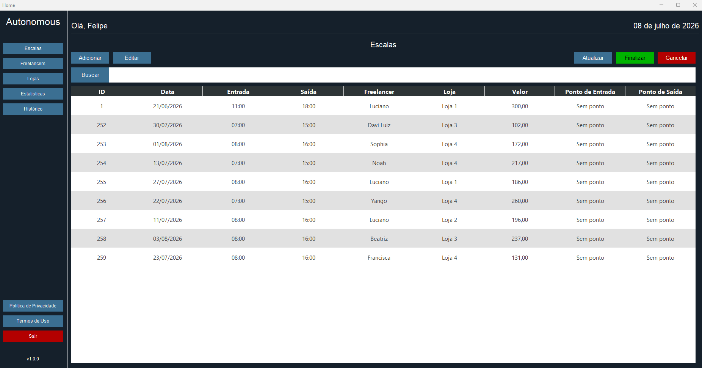

# Autonomous Desktop

Este repositório contém um programa desktop desenvolvido em Java para gestão de colaboradores de uma sorveteria. O programa faz parte de uma solução acadêmica desenvolvida no 5º semestre da faculdade, com o objetivo de atender uma demanda real de uma comunidade externa à instituição de ensino. A aplicação permite gerenciar colaboradores freelancers, facilitando o controle de atividades, organização e apoio à operação do negócio.
**`Observação:`** Todos os dados utilizados neste projeto são fictícios e servem apenas para fins de demonstração.

---

### Estrutura do Projeto

| Pacote               | Responsabilidade                                                                                                       
|:---------------------|:-----------------------------------------------------------------------------------------------------------------------|
| **`clients`**        | Comunicação com a API externa, encapsulando chamadas HTTP e tratamento de respostas                                    |
| **`configurations`** | Configurações do programa                                                                                              |
| **`controllers`**    | Intermediam as requisições vindas da interface, organizando o fluxo e delegando as ações para os serviços apropriados. |
| **`dtos`**           | Objetos utilizados para transportar dados entre camadas e na comunicação com a API.                                    |
| **`entities`**       | Representações das entidades de domínio, geralmente espelhando a estrutura retornada pela API.                         |
| **`enums`**          | Definição de constantes tipadas para controle de valores fixos e padronização de regras.                               |
| **`exceptions`**     | Tratamento de exceptions.                                                                                              |
| **`services`**       | Regras de negócio da aplicação, coordenando operações e aplicando validações.                                |
| **`validators`**     | Validação mínima de dados enviados para a API.                                                                         |
| **`view`**           | Estrutura da UI do programa feita com Swing.                                                                  |

---

### Como Executar o Projeto

#### Pré-requisitos

* Java JDK 21 ou superior
* IDE (IntelliJ, Eclipse ou VS Code)

#### Passos

1. Baixe o projeto
2. Abra o projeto na sua IDE
3. Localize a classe principal (App.java)
4. Execute a aplicação

**Observação:** Para que a aplicação funcione corretamente, também é necessário executar a API.

---

### Outros Componentes da Solução

Esta aplicação faz parte de uma solução composta por:

- **API:** <https://github.com/FeMartins2002/Faculdade-Autonomous-API>
- **Web:** <https://github.com/FeMartins2002/Faculdade-Autonomous-Web>
